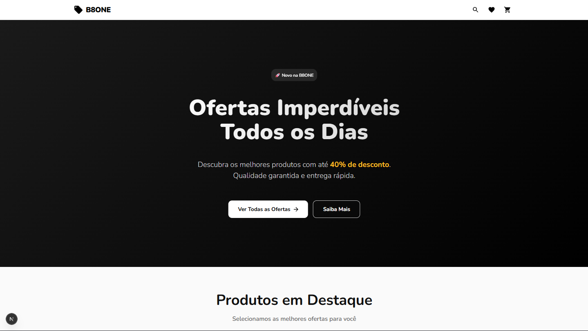
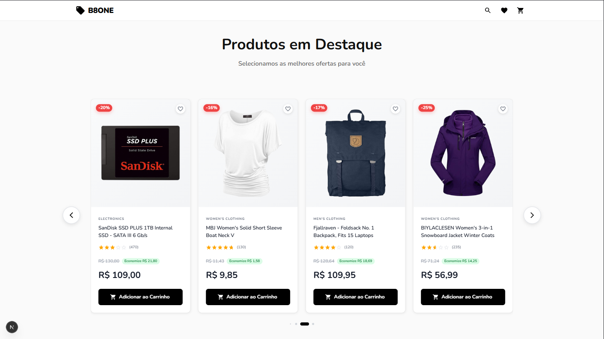
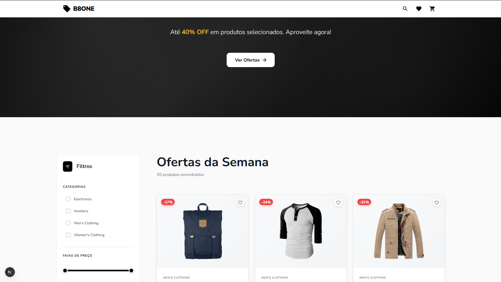
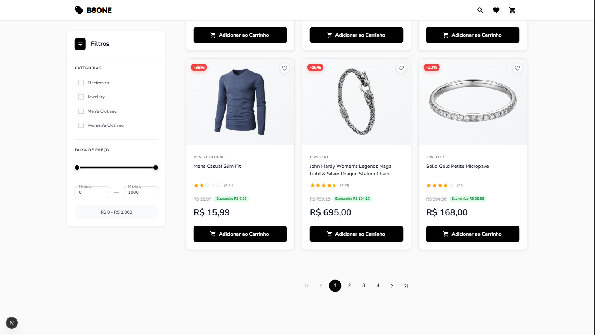
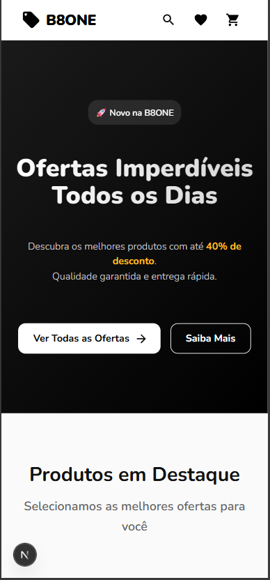
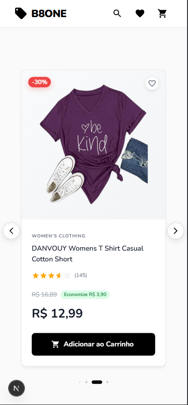
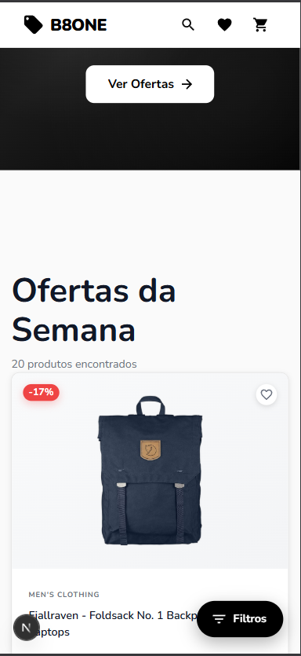
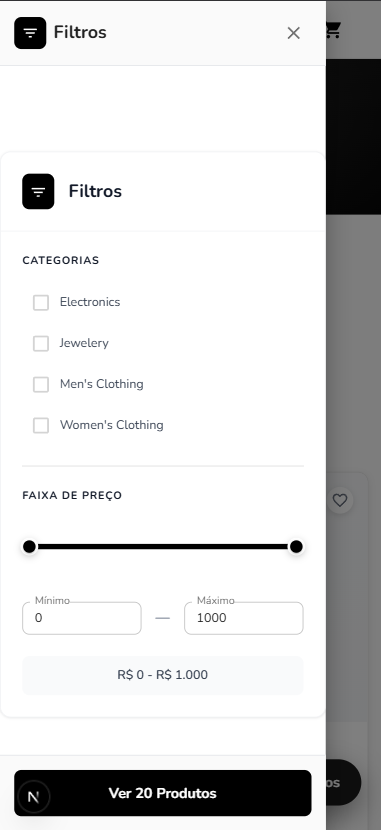

# 🛍️ B8ONE - E-commerce Challenge

<div align="center">
  


E-commerce moderno desenvolvido com Next.js 16, TypeScript e Material UI, apresentando ofertas imperdíveis com até 40% de desconto.

[🌐 Ver Demo](https://b8one-challage.vercel.app/) · [📝 Reportar Bug](https://github.com/felipengr/b8one-challage/issues) · [✨ Solicitar Feature](https://github.com/felipengr/b8one-challage/issues)

</div>

---

## 📸 Screenshots

### 🖥️ Desktop

<div align="center">

#### Home Page


#### Produtos em Destaque com Carrossel


#### Página de Ofertas com Filtros


#### Filtros Avançados


</div>

### 📱 Mobile

<div align="center">

<table>
  <tr>
    <td align="center">
      
      <br />
      <strong>Home</strong>
    </td>
    <td align="center">
      
      <br />
      <strong>Carrossel</strong>
    </td>
    <td align="center">
      
      <br />
      <strong>Ofertas</strong>
    </td>
    <td align="center">
      
      <br />
      <strong>Filtros</strong>
    </td>
  </tr>
</table>

</div>

---

## 🎯 Sobre o Projeto

Este projeto foi desenvolvido como um desafio técnico para demonstrar habilidades em:

- ✅ Desenvolvimento de aplicações e-commerce modernas
- ✅ Arquitetura de componentes escalável
- ✅ Integração com APIs externas
- ✅ Design responsivo e acessível
- ✅ Performance e otimizações
- ✅ Boas práticas de código

---

## 🚀 Tecnologias

### Core
- **[Next.js 16](https://nextjs.org/)** - Framework React com App Router e Server Components
- **[TypeScript](https://www.typescriptlang.org/)** - Tipagem estática e segurança de tipos
- **[React 19](https://react.dev/)** - Biblioteca para construção de interfaces

### UI/UX
- **[Material UI v6](https://mui.com/)** - Biblioteca de componentes React
- **[Swiper](https://swiperjs.com/)** - Carrossel moderno e touch-friendly
- **CSS3** - Estilização customizada

### API & Data
- **[Fake Store API](https://fakestoreapi.com/)** - API REST para dados de produtos

### Tools
- **ESLint** - Linting e qualidade de código
- **Git** - Controle de versão

---

## ✨ Funcionalidades

### 🏠 Home Page
- Hero section com call-to-action
- Carrossel de 8 produtos em destaque
- Seção de expertise técnica
- CTA final para conversão

### 🛒 Página de Ofertas
- **Filtros Avançados**
  - Filtro por categoria (4 categorias disponíveis)
  - Filtro por faixa de preço (slider interativo)
  - Preço máximo calculado dinamicamente
  - Badge de categoria ativa
  - Botão para limpar todos os filtros

- **Grid de Produtos**
  - Layout responsivo (1/2/3 colunas)
  - Sistema de favoritos
  - Badge de desconto (10-40%)
  - Cálculo de economia
  - Avaliações com estrelas
  - Paginação com 6 produtos por página

### 🎨 UX/UI
- **Loading States**
  - Skeleton para produtos
  - Skeleton para filtros
  - Skeleton para carrossel
  
- **Componentes Interativos**
  - Hover effects em cards
  - Botões com animações
  - Transições suaves
  - Feedback visual em todas as ações

### 📱 Responsividade
- **Mobile First**
  - Carrossel: 1 produto por vez
  - Grid: 1 coluna
  - Filtros: collapse/expand

- **Tablet**
  - Carrossel: 2-3 produtos
  - Grid: 2 colunas

- **Desktop**
  - Carrossel: 4 produtos
  - Grid: 3 colunas
  - Filtros: sidebar fixa

---

## 🏗️ Arquitetura do Projeto
```
b8one-challenge/
├── 📁 app/
│   ├── 📁 ofertas/
│   │   └── 📄 page.tsx              # Página de ofertas
│   ├── 📄 globals.css               # Estilos globais
│   ├── 📄 layout.tsx                # Layout principal
│   ├── 📄 page.tsx                  # Home page
│   └── 📄 swiper-custom.css         # Estilos do carrossel
│
├── 📁 components/
│   ├── 📁 filters/
│   │   ├── 📄 CategoryFilter.tsx    # Filtro de categorias
│   │   └── 📄 PriceRangeFilter.tsx  # Filtro de preço
│   │
│   ├── 📁 home/
│   │   ├── 📄 CTASection.tsx        # Call to action
│   │   ├── 📄 ExpertiseSection.tsx  # Seção de expertise
│   │   ├── 📄 FeaturedProducts.tsx  # Produtos destaque
│   │   └── 📄 HeroSection.tsx       # Hero principal
│   │
│   ├── 📁 ofertas/
│   │   ├── 📄 FiltersSidebar.tsx    # Sidebar de filtros
│   │   ├── 📄 OfertasHeader.tsx     # Header da página
│   │   └── 📄 ProductsGrid.tsx      # Grid de produtos
│   │
│   ├── 📄 Banner.tsx                # Banner reutilizável
│   ├── 📄 CarouselSkeleton.tsx      # Loading carrossel
│   ├── 📄 FiltersSkeleton.tsx       # Loading filtros
│   ├── 📄 Footer.tsx                # Rodapé
│   ├── 📄 Navbar.tsx                # Barra de navegação
│   ├── 📄 ProductCard.tsx           # Card de produto
│   ├── 📄 ProductCarousel.tsx       # Carrossel de produtos
│   ├── 📄 ProductFilters.tsx        # Filtros principais
│   ├── 📄 ProductSkeleton.tsx       # Loading produto
│   └── 📄 ThemeRegistry.tsx         # Configuração MUI
│
├── 📁 lib/
│   ├── 📄 api.ts                    # Funções de API
│   └── 📄 theme.ts                  # Tema Material UI
│
├── 📁 types/
│   └── 📄 product.ts                # Tipagens TypeScript
│
└── 📄 package.json
```

---

## 🎨 Design System

### Paleta de Cores
```css
/* Primary */
--primary-black: #000000
--primary-white: #ffffff

/* Grays */
--gray-50: #fafafa
--gray-100: #f3f4f6
--gray-200: #e5e7eb
--gray-300: #d1d5db
--gray-400: #9ca3af
--gray-500: #4b5563
--gray-600: #374151
--gray-700: #1f2937
--gray-800: #111827
--gray-900: #000000

/* Accent */
--yellow-400: #fbbf24
--red-500: #ef4444
--green-50: #dcfce7
--green-700: #15803d
```

### Tipografia

- **Font Family**: Nunito (Google Fonts)
- **Weights**: 300, 400, 600, 700, 900

---

## 💻 Instalação e Uso

### Pré-requisitos

- Node.js 18+ 
- npm ou yarn

### Instalação
```bash
# Clone o repositório
git clone https://github.com/felipengr/b8one-challage.git

# Entre na pasta do projeto
cd b8one-challage

# Instale as dependências
npm install

# Execute o projeto em modo desenvolvimento
npm run dev
```

Acesse [http://localhost:3000](http://localhost:3000) no seu navegador.

### Build para Produção
```bash
# Criar build de produção
npm run build

# Executar build de produção
npm start
```

---

## 🎯 Decisões Técnicas

### Por que Next.js 16?

- **App Router**: Melhor performance e SEO
- **Server Components**: Renderização otimizada
- **Built-in fetch**: Cache automático
- **TypeScript**: Suporte nativo

### Por que Material UI?

- **Componentes prontos**: Acelera desenvolvimento
- **Acessibilidade**: WCAG compliance
- **Customizável**: Theme system completo
- **Manutenção**: Comunidade ativa

### Componentização

- **Atomic Design**: Componentes reutilizáveis
- **Single Responsibility**: Cada componente faz uma coisa
- **Props Interface**: Type-safety garantido
- **Organização**: Estrutura por features

### Performance

- **Cache de 1 hora**: Requisições otimizadas
- **Lazy Loading**: Componentes sob demanda
- **Image Optimization**: Next.js Image
- **Code Splitting**: Bundles menores

---

## 🚀 Funcionalidades Futuras

- [ ] Carrinho de compras funcional
- [ ] Autenticação de usuários
- [ ] Wishlist persistente
- [ ] Busca de produtos
- [ ] Ordenação (preço, popularidade)
- [ ] Reviews de produtos
- [ ] Checkout completo
- [ ] Integração com gateway de pagamento
- [ ] PWA (Progressive Web App)
- [ ] Modo escuro

---

## 📈 Performance

- **Lighthouse Score**: 95+ 
- **First Contentful Paint**: < 1.5s
- **Time to Interactive**: < 3s
- **Total Bundle Size**: ~200KB (gzipped)

---

## 🤝 Contribuindo

Contribuições são sempre bem-vindas!

1. Fork o projeto
2. Crie uma branch para sua feature (`git checkout -b feature/MinhaFeature`)
3. Commit suas mudanças (`git commit -m 'feat: Adiciona MinhaFeature'`)
4. Push para a branch (`git push origin feature/MinhaFeature`)
5. Abra um Pull Request

---

## 📝 Licença

Este projeto está sob a licença MIT. Veja o arquivo [LICENSE](LICENSE) para mais detalhes.

---

## 👨‍💻 Desenvolvedor

<div align="center">


### Felipe Nogueira

**Especialista em E-commerce | VTEX IO | FastStore**

Desenvolvedor Full Stack com expertise em criar experiências de compra excepcionais utilizando as melhores práticas do mercado.

[](https://www.nogueiradev.com.br/)
[](https://www.linkedin.com/in/nogueirafelipe94/)
[](https://github.com/felipengr)

### 🛠️ Experiência

- **VTEX IO**: Desenvolvimento de stores customizadas e componentes reutilizáveis
- **FastStore**: E-commerces de alta performance com framework headless
- **E-commerce**: Especialista em criar experiências de compra excepcionais

</div>

---

<div align="center">

### ⭐ Se este projeto foi útil para você, considere dar uma estrela!

**Desenvolvido com ❤️ por [Felipe Nogueira](https://www.nogueiradev.com.br/)**

</div>
```
